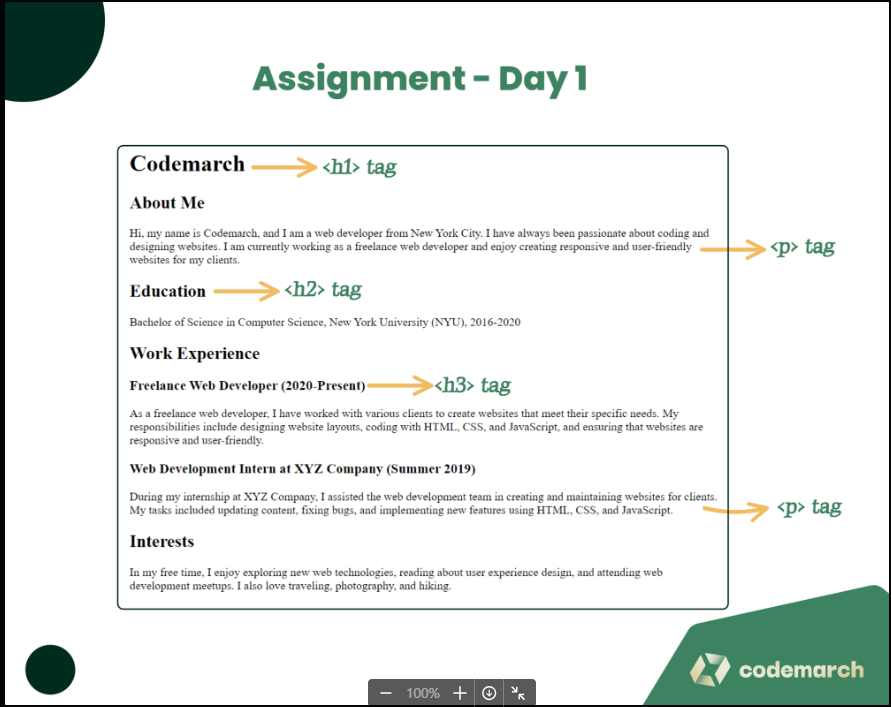
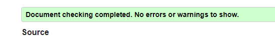

# Day - 01

- Topic 1 - Introduction to HTML
- Topic 2 - Structure Of an HTML
- Topic 3 - HTML Headings
- Topic 4 - HTML Paragraphs

See All topic here:<https://mdjunaidap.notion.site/Day-01-ca439d1092c745b685b63fee65fa4788>

## Assignment - Personal Profile Page

### Objective

Create a simple personal profile webpage using HTML that demonstrates your understanding of basic HTML structure, headings, and paragraphs.

### Requirements

1. Create an HTML file named "profile.html".
2. Include the necessary HTML tags to define the structure of the document, such as the `<!DOCTYPE>`, `<html>`, `<head>`, and `<body>` tags.
3. Inside the `<head>` tag, add a `<title>` tag to give your webpage a title, such as "My Personal Profile".
4. Use appropriate heading tags (`<h1>`, `<h2>`, etc.) to create a hierarchy of headings on your profile page. For example:
    - Use an `<h1>` tag for your name.
    - Use `<h2>` tags for sections like "About Me", "Education", "Work Experience", and "Interests".
    - Use `<h3 class="section-sub-title" >` tags for subheadings within sections if needed.
5. Write paragraphs about yourself using the `
` tag in each section. Include information such as:
    - About Me: A brief introduction to who you are, your background, and your current situation.
    - Education: A list of your educational background, including the names of the institutions and the years attended.
    - Work Experience: A description of your work experience, with job titles, company names, and brief summaries of your responsibilities.
    - Interests: A list of your hobbies and interests.
6. Use proper indentation and formatting to make your HTML code easily readable.
7. Save your HTML file and open it in a web browser to see your personal profile webpage.

### Submission

Submit the "profile.html" file containing your personal profile webpage. Ensure that your code follows the assignment requirements and demonstrates your understanding of HTML structure, headings, and paragraphs.

### Here is your Day-1 Assignment

## CREDITS

- **Website:**[codemarch](https://codemarch.gumroad.com/)
- **Social:** [twitter](https://twitter.com/codemarch) | [Discord](https://discord.com/invite/7g9WddcyKt)

## validation

