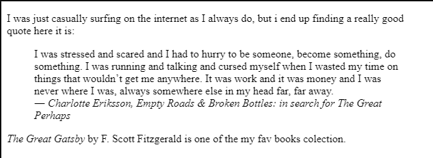
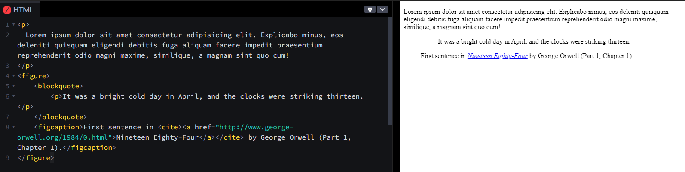

# Notes on Day 2: Quotes, blockquote and cite

## short quote `<q>` element

- `<q>` element is used to mark short quotations or inline quotations within a paragraph

## `blockquote` and `cite` elements

### `blockquote` element and `cite` attribute

- The `<blockquote>` element is used to indicate a block of quoted text within an HTML document.

- By default, the browser will typically indent the content inside the `<blockquote>` element to visually distinguish it from the surrounding text.

- and the cite attribute is used to specify the source of the quotation.

### cite as element

- The `<cite>` element is used to indicate the title or source of a creative work, such as the title of a book, the name of an article, or the source of a quote.
- Browsers may render the content inside the `<cite>` element in italics by default

#### Example

```HTML
<p>I was just casually surfing on the internet as I always do, but i end up finding a really good quote here it is:</p>
<blockquote cite="https://www.goodreads.com/work/quotes/24944198-empty-roads-broken-bottles-in-search-for-the-great-perhaps">
  ,I was stressed and scared and I had to hurry to be someone, become something, do something. I was running and talking and cursed myself when I wasted my time on things that wouldn’t get me anywhere. It was work and it was money and I was never where I was, always somewhere else in my head far, far away. <br>
  <cite>― Charlotte Eriksson, Empty Roads & Broken Bottles: in search for The Great Perhaps</cite>
</blockquote>
<p><cite>The Great Gatsby</cite> by F. Scott Fitzgerald is one of the my fav books colection.</p>
```

**Output:**



