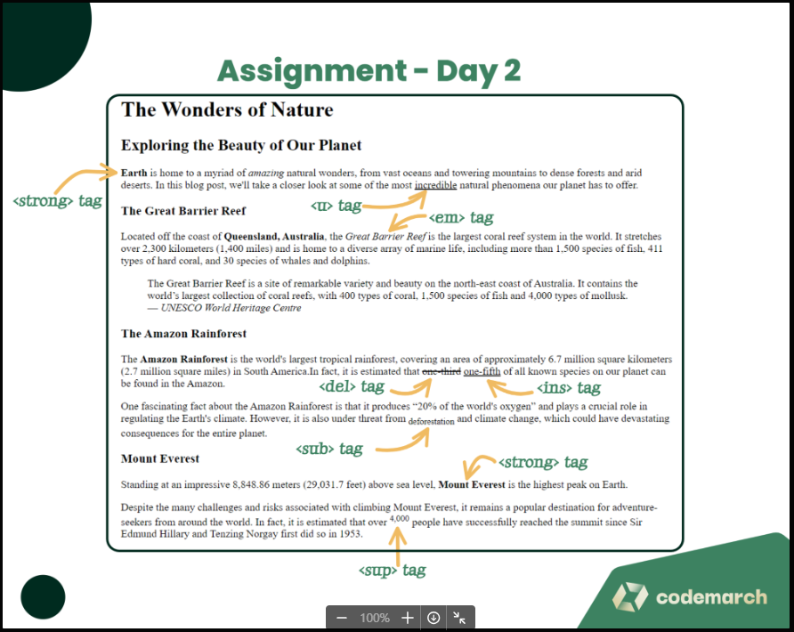
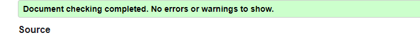

# Day - 02

- Topic 1 - HTML Styles
- Topic 2 - HTML Text Formatting
- Topic 3 - HTML Indentation
- Topic 4 - HTML Quotation

See all Day 2 topics here: <https://mdjunaidap.notion.site/Day-02-bd9b6bd3b3544ec7973f5356f4b090ee>

## Assignment - Styling a Blog Post

### Objective

Create a simple blog post webpage using HTML that demonstrates your understanding of HTML styles, text formatting, indentation, and quotations.

### Requirements

1. Create an HTML file named "blog-post.html".

2. Include the necessary HTML tags to define the structure of the document, such as the `<!DOCTYPE>`, `<html>`, `<head>`, and `<body>` tags.

3. Inside the `<head>` tag, add a `<title>` tag to give your webpage a title, such as "My Blog Post".

4. Use appropriate heading tags (`<h1>`, `<h2>`, etc.) to create a title and subtitles for your blog post.

5. Write a blog post with multiple paragraphs using the `
` tag. Include the following formatting elements:
   1. Bold text using the `<strong>` or `<b>` tag.
   2. Italic text using the `<em>` or `<i>` tag.
   3. Underlined text using the `<u>` tag.
   4. Strike-through text using the `<del>` or `<s>` tag.
   5. Superscript text using the `` tag.
   6. Subscript text using the `` tag.

6. Include at least one blockquote using the `<blockquote>` tag and one inline quotation using the `<q>` tag.

7. Use proper indentation and formatting to make your HTML code easily readable.

8. Save your HTML file and open it in a web browser to see your styled blog post webpage.

### Submission

Submit the "blog-post.html" file containing your styled blog post webpage. Ensure that your code follows the assignment requirements and demonstrates your understanding of HTML styles, text formatting, indentation, and quotations.

### Here is your Day 2 Assignment

## CREDITS

- **Website:**[codemarch](https://codemarch.gumroad.com/)
- **Social:** [twitter](https://twitter.com/codemarch) | [Discord](https://discord.com/invite/7g9WddcyKt)

## validation

