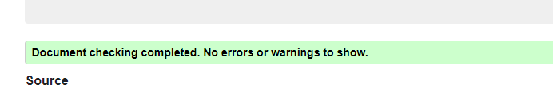

# Day - 03

- Topic 1 - HTML Comments
- Topic 2 - HTML Colors
- Topic 3 - HTML Links
- Topic 4 - HTML Images

See All Day 3 topics here:<https://mdjunaidap.notion.site/Day-03-0be53f1fa587417c8a9ba8ccfcb6f11b>

## Assignment: Create a Simple Portfolio Webpage

### Objective

Create a simple portfolio webpage using HTML that demonstrates your understanding of HTML comments, colors, links, and images.

## Requirements

1. Create an HTML file named "portfolio.html".
2. Include the necessary HTML tags to define the structure of the document, such as the `<!DOCTYPE>`, `<html>`, `<head>`, and `<body>` tags.
3. Inside the `<head>` tag, add a `<title>` tag to give your webpage a title, such as "My Portfolio".
4. Use appropriate heading tags (`<h1>`, `<h2>`, etc.) to create a title for your portfolio page.
5. Include the following elements in your webpage:
    - HTML comments to describe the purpose of different sections of your code.
    - Text with different colors using the `style` attribute (Note: For real-world projects, it's recommended to use CSS for styling).
    - At least two links using the `<a>` tag, one to an external website and one to an email address.
    - At least one image using the `` tag, with a relevant `alt` attribute.
6. Use proper indentation and formatting to make your HTML code easily readable.
7. Save your HTML file and open it in a web browser to see your simple portfolio webpage.

## Submission

Submit the "portfolio.html" file containing your simple portfolio webpage. Ensure that your code follows the assignment requirements and demonstrates your understanding of HTML comments, colors, links, and images.

### Assignment Resources**

.png)

.png)

### Here is your Day 3 Assignment

.png)

## CREDITS

- **Website:**[codemarch](https://codemarch.gumroad.com/)
- **Social:** [twitter](https://twitter.com/codemarch) | [Discod](https://discord.com/invite/7g9WddcyKt)

## validation

