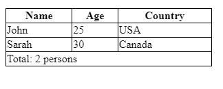

# Day 04 : Table semantics

## table, tr, th and td elements

Syntax:

```html
<table>
  <tr>
    <th>For column heading</th>
  </tr>
  <tr>
    <td>for column data</td>
  </tr>
</table>
```

```css
  table,td{
    border:1px solid;
    border-collapse:collapse;
  }
```

## thead, tbody, tfoot elements

- `<thead>` element:
  - It is used to define the header section of a table.
  - It is typically placed at the beginning of the `<table>` element
  - The content within `<thead>` is typically displayed at the top of the table
  - and is often styled differently from the table body.
  
- `<tbody>` element:
  - It is used to group the main content or body of a table. It comes after the `<thead>` element.
  - Browsers will often style the content inside `<tbody>` as the main body of the table.

- `<tfoot>` element:
  - It is used to define the footer section of a table.
  - It is typically placed after the `<tbody>` element
  - The content within `<tfoot>` is typically displayed at the bottom of the table and
  - can be used to provide summary information or additional notes.

### Example 2

```CSS
  table,th, td{
    border:1px solid;
    border-collapse:collapse;
  }
table{
  width:300px;
}
```

```HTML
<table>
  <thead>
    <tr>
      <th>Name</th>
      <th>Age</th>
      <th>Country</th>
    </tr>
  </thead>
  <tbody>
    <tr>
      <td>John</td>
      <td>25</td>
      <td>USA</td>
    </tr>
    <tr>
      <td>Sarah</td>
      <td>30</td>
      <td>Canada</td>
    </tr>
  </tbody>
  <tfoot>
    <tr>
      <td colspan="3">Total: 2 persons</td>
    </tr>
  </tfoot>
</table>
```



## caption element and colgroup

### caption

- caption: use to give the title and description of the table at top.
- used just after the table tag but before the thead tag.

**Example:**

1. <https://developer.mozilla.org/en-US/docs/Web/HTML/Element/caption>

### colgroup and col

- colgroup used with it's child tag that is col tag.
- both are use to categorized similar type of tag in table.
- it help to apply consistent styling and define properties for columns.

**Example:**

1. <https://www.w3schools.com/tags/tryit.asp?filename=tryhtml_colgroup_test>
2. <https://developer.mozilla.org/en-US/docs/Web/HTML/Element/colgroup>.
