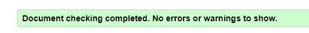

# Day - 04

- Topic 1 - HTML Favicon
- Topic 2 - HTML Tables
- Topic 3 - HTML Lists
- Topic 4 - HTML Block and Inline Elements

To see all topics of day 4 visit: <https://mdjunaidap.notion.site/Day-04-418925f621af4b4995f5f4f89db298a4)>

## Assignment: Create a Restaurant Menu Webpage

### Objective

Create a restaurant menu webpage using HTML that demonstrates your understanding of favicons, tables, lists, and block and inline elements.

### Requirements

1. Create an HTML file named "restaurant-menu.html".
2. Include the necessary HTML tags to define the structure of the document, such as the `<!DOCTYPE>`, `<html>`, `<head>`, and `<body>` tags.
3. Inside the `<head>` tag, add a `<title>` tag to give your webpage a title, such as "Restaurant Menu".
4. Add a favicon to your webpage using the `<link>` tag inside the `<head>` section (Note: You will need an actual .ico file or a valid URL pointing to a .ico file to complete this step).
5. Use appropriate heading tags (`<h1>`, `<h2>`, etc.) to create a title and subtitles for your restaurant menu.
6. Create a table using the `<table>`, `<tr>`, `<th>`, and `<td>` tags to display the menu items, their descriptions, and prices.
7. Include the following elements in your webpage:
    - An unordered list using the `<ul>` and `<li>` tags to list the restaurant's special offers or daily specials.
    - At least one block element, such as a `
` tag, to display additional information about the restaurant or its menu.
    - At least one inline element, such as a `` tag, to highlight a specific part of the text within the block element.
8. Use proper indentation and formatting to make your HTML code easily readable.
9. Save your HTML file and open it in a web browser to see your restaurant menu webpage.

### Submission

Submit the "restaurant-menu.html" file containing your restaurant menu webpage. Ensure that your code follows the assignment requirements and demonstrates your understanding of favicons, tables, lists, and block and inline elements.

### Here is your Day 4 Assignment

.png>)

## CREDITS

- **Website:**[codemarch](https://codemarch.gumroad.com/)
- **Social:** [twitter](https://twitter.com/codemarch) | [Discod](https://discord.com/invite/7g9WddcyKt)

## validation

