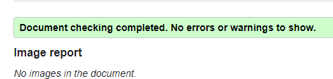

# Day - 05

- Topic 1 - HTML Iframes
- Topic 2 - HTML Multimedia
- Topic 3 - HTML Forms
- Topic 4 - HTML Canvas
- Topic 5 - HTML Emojis

To See Day 5 all topic here: <https://mdjunaidap.notion.site/Day-05-fd1bafa395784a38a4c1fa8a96ccc1bc>

## Assignment: Create a Feedback Form Webpage

### Objective

Create a feedback form webpage using HTML that demonstrates your understanding of iframes, multimedia, forms, canvas, and emojis

### Requirements

1. Create an HTML file named "feedback.html".
2. Include the necessary HTML tags to define the structure of the document, such as the `<!DOCTYPE>`, `<html>`, `<head>`, and `<body>` tags.
3. Inside the `<head>` tag, add a `<title>` tag to give your webpage a title, such as "Feedback Form".
4. Use appropriate heading tags (`<h1>`, `<h2>`, etc.) to create a title and subtitles for your feedback form.
5. Include the following elements in your webpage:
    - An iframe that displays a map or a video from a website like Google Maps or YouTube.
    - An audio or video clip using the `<audio>` or `<video>` tag.
    - A feedback form using the `<form>`, `<input>`, `<textarea>`, and `<button>` tags. The form should collect the visitor's name, email address, and feedback.
    - A canvas with a simple drawing, like a rectangle or circle, using the `<canvas>` tag.
    - An emoji in the text using the appropriate Unicode.
6. Use proper indentation and formatting to make your HTML code easily readable.
7. Save your HTML file and open it in a web browser to see your feedback form webpage.

### Submission

Submit the "feedback.html" file containing your feedback form webpage. Ensure that your code follows the assignment requirements and demonstrates your understanding of iframes, multimedia, forms, canvas, and emojis.

### Here is your Day 5 Assignment

.png>)

## CREDITS

- **Website:**[codemarch](https://codemarch.gumroad.com/)
- **Social:** [twitter](https://twitter.com/codemarch) | [Discod](https://discord.com/invite/7g9WddcyKt)

## validation

