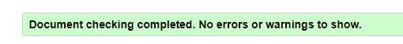

# Day - 07

## Assignment

Create a Personal Blog Webpage

### Objective

Create a personal blog webpage using HTML that demonstrates your understanding of important HTML topics in a simple yet amazing way.

### Requirements

1. Create an HTML file named "personal_blog.html".
2. Start your HTML document with a `<!DOCTYPE html>` declaration.
3. Include the necessary HTML tags to define the structure of the document, such as the `<html>`, `<head>`, and `<body>` tags.
4. Inside the `<head>` tag, add a `<title>` tag to give your webpage a title, such as "My Personal Blog".
5. Also in the `<head>` tag, include the viewport meta tag to ensure your webpage is responsive on different devices.
6. Use semantic HTML elements like `<header>`, `<footer>`, `<nav>`, `<section>`, `<article>`, and `<aside>` to structure your webpage.
7. Include the following elements in your webpage:
    - A header with a heading and a tagline using the `<header>` tag.
    - A navigation bar using the `<nav>` tag.
    - A main section that includes multiple blog posts using the `<section>` and `<article>` tags. Each blog post should have a title, date, author, and content.
    - An aside section that includes a list of blog categories, recent posts, and a subscription form using the `<aside>` tag.
    - A footer that includes copyright information, social media links, and a contact email using the `<footer>` tag.
8. Use HTML elements for text formatting such as headings, paragraphs, bold, italics, and lists.
9. Create a table to display data in one of your blog posts.
10. Include images, links, and multimedia elements such as audio or video.
11. Use proper indentation and formatting to make your HTML code easily readable.
12. Save your HTML file and open it in a web browser to see your personal blog webpage.

### Submission

Submit the "personal_blog.html" file containing your personal blog webpage. Ensure that your code follows the assignment requirements and demonstrates your understanding of important HTML topics.

Note: This assignment does not include CSS styling, so the visual appearance of your webpage will be basic. Once you learn CSS, you can improve the styling of your personal blog webpage.

### Here is your Day 7 Project

.png)

## CREDITS

- **Website:**[codemarch](https://codemarch.gumroad.com/)
- **Social:** [twitter](https://twitter.com/codemarch) | [Discod](https://discord.com/invite/7g9WddcyKt)

## validation

