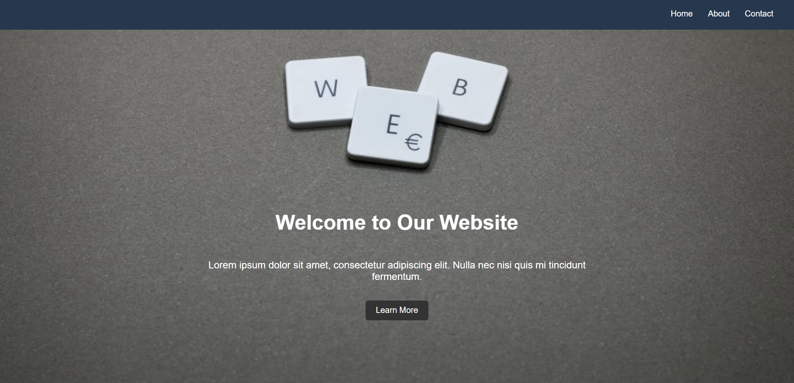
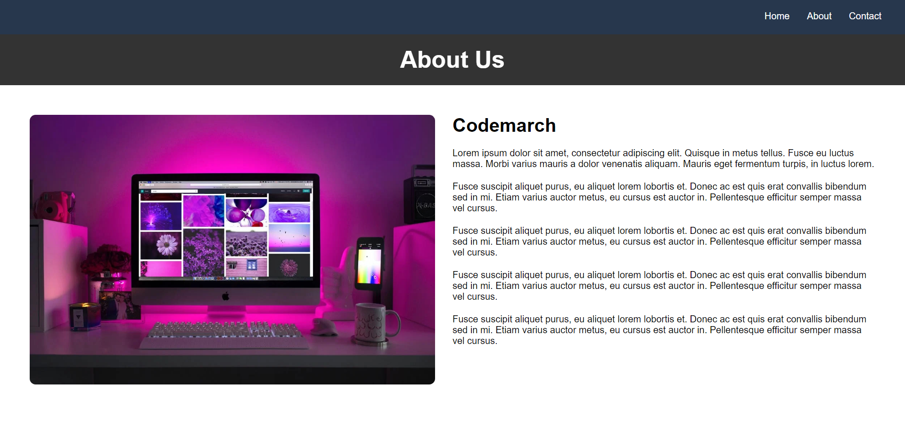
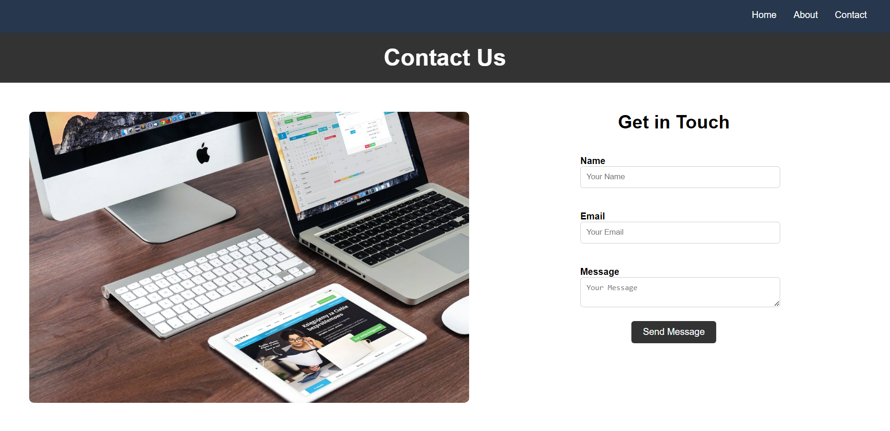
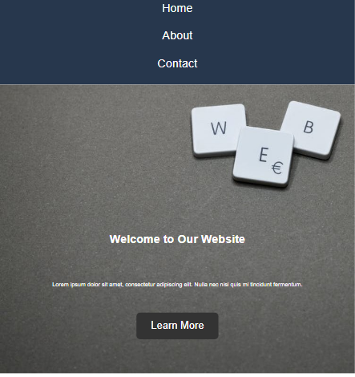
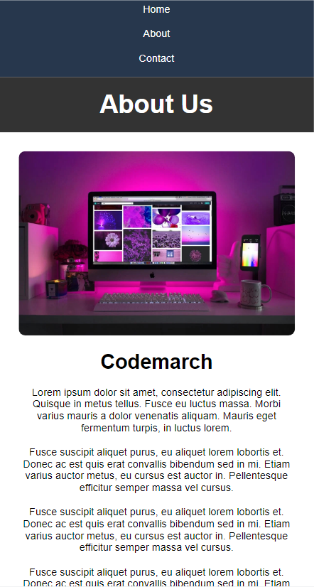
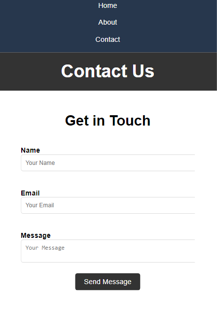

# Day - 19

- Topic 1 - Responsive Web Design
- Topic 2 - The Viewport
- Topic 3 - Media Queries
- Topic 4 - CSS Advance Selector
- Topic 5 - CSS Specificity

To read any of the above topic please visit: <https://mdjunaidap.notion.site/Day-19-7922becf0e974b00b71840502b36cee7?pvs=4>

## Assignment: Responsive Web Design Mastery

### Objective

The objective of this assignment is to demonstrate your understanding of responsive web design principles and techniques. You will showcase your skills in using the viewport meta tag, media queries, and advanced CSS selectors to create a responsive website.

### Requirements

1. Create a static website with a minimum of three pages (e.g., Home, About, Contact).
2. Implement a responsive design that adapts to different screen sizes and devices.
3. Use the viewport meta tag to ensure proper rendering and scaling on mobile devices.
4. Utilize media queries to apply specific styles based on different screen sizes.
5. Apply advanced CSS selectors to target specific elements and apply custom styles.

### Submission

1. An HTML file.
2. A CSS file.
3. A summary of what you've learned in this assignment.

### Assignment Resources

### Here is your Day 19 Assignment

---

### Mobile view

## CREDITS

- **Website:**[codemarch](https://codemarch.gumroad.com/)
- **Social:** [twitter](https://twitter.com/codemarch) | [Discod](https://discord.com/invite/7g9WddcyKt)
