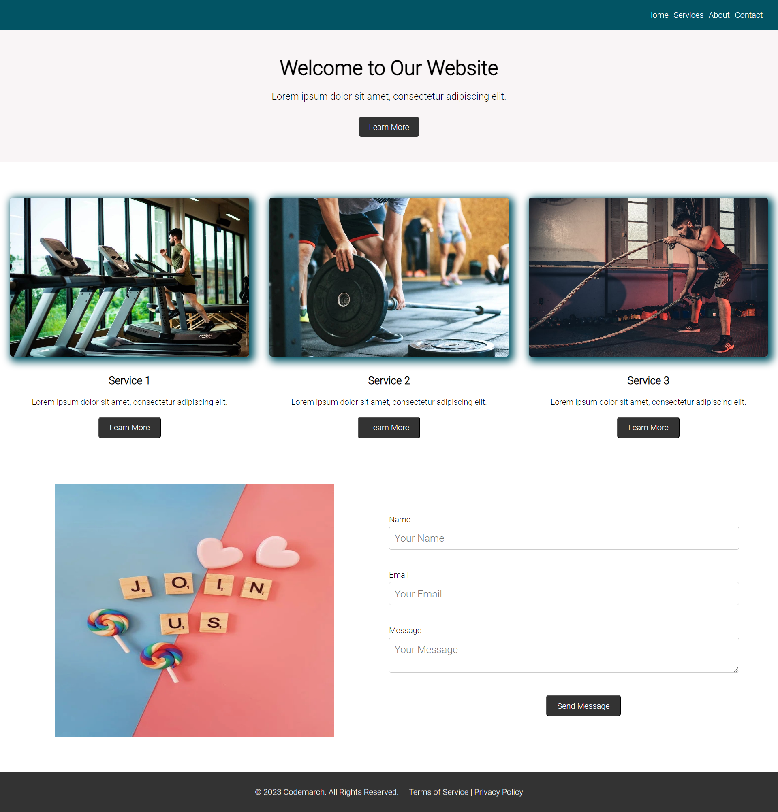

# Day - 20

- Topic 1 - CSS Multiple Columns
- Topic 2 - CSS Flexbox Model (Flex Container)
- Topic 3 - CSS Flex Items

## Assignment: CSS Multiple Columns and Flexbox Model

### Objective

Create a responsive web page layout using CSS Multiple Columns and Flexbox Model. Apply styling and layout techniques to achieve a multi-column design and flexible content arrangement.

### Requirements

1. Navbar: Create a responsive navigation bar with menu items such as Home, Services, About, and Contact.
2. Hero Section: Design a hero section with a title, description, and a button. It should have a background image and be centered vertically and horizontally.
3. Service Section: Split the section into three equal parts using flexbox. Each part should include an image, a heading, a paragraph, and a button.
4. Contact Section: Display a contact form and an accompanying image side by side using flexbox. The form should include fields for name, email, and message.
5. Footer: Create a footer section at the bottom of the page with copyright information and links to the terms of service and privacy policy.

The entire layout should be designed using flexbox properties to achieve the desired positioning and responsiveness.

### Submission

1. An HTML file.
2. A CSS file.
3. A summary of what you've learned in this assignment.

### Assignment Resources

### Here is your Day 20 Assignment

## CREDITS

- **Website:**[codemarch](https://codemarch.gumroad.com/)
- **Social:** [twitter](https://twitter.com/codemarch) | [Discod](https://discord.com/invite/7g9WddcyKt)
