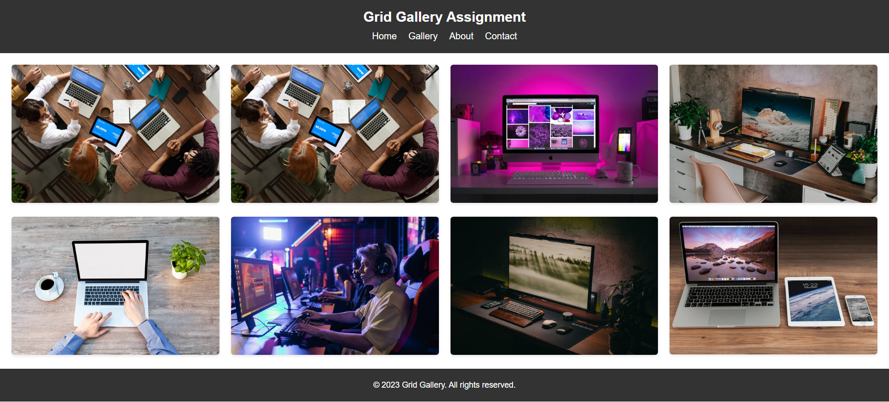

# Day - 21

- Topic 1 - CSS Grid Introduction
- Topic 2 - CSS Grid Container
- Topic 3 - CSS Grid Item
- Topic 4 - Naming Grid Items
- Topic 5 - CSS Website Layout
- Topic 6 - CSS Framework

To read any of the above topic please visit: <https://mdjunaidap.notion.site/Day-20-bda47d5a13894ca793500da443cab26e>

## Assignment: Grid Gallery

### Objective

The objective of this assignment is to demonstrate your understanding of the CSS Grid concept by creating a responsive image gallery layout.

### Requirements

1. Create an HTML page that includes a header, a section for the image gallery, and a footer.
2. Implement a CSS Grid layout for the image gallery section.
3. The image gallery should display a collection of images in a grid format.
4. Each image should be evenly spaced and have a consistent size.
5. Ensure that the image gallery layout is responsive and adapts to different screen sizes.
6. Apply appropriate styling to enhance the appearance of the image gallery.
7. Add hover effects or transitions to improve user experience.
8. Use appropriate image optimization techniques for better performance.
9. Include a responsive header and footer with relevant information.

### Submission

1. An HTML file.
2. A CSS file.
3. A summary of what you've learned in this assignment.

### Assignment Resources

### Here is your Day 21 Assignment

