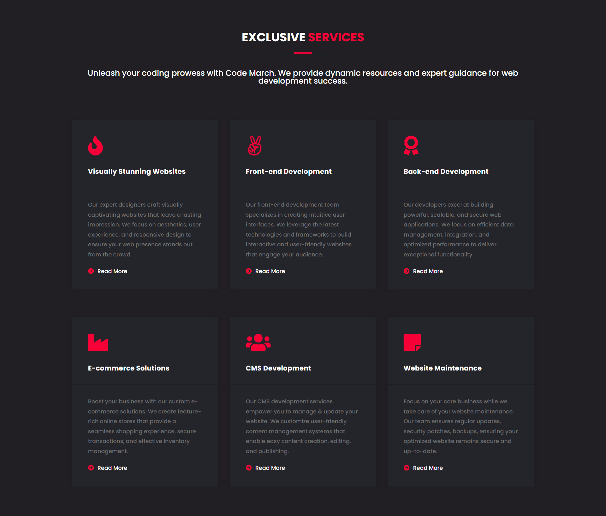
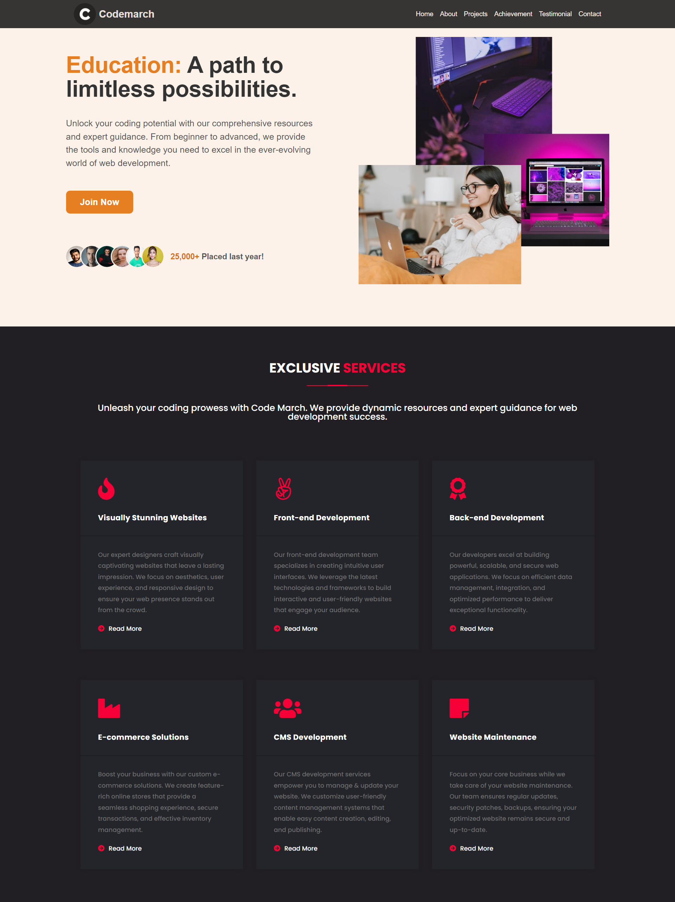

# Day - 22

## Create a Website: Navbar, Hero Section, and Service Section

### Navbar

- Design a responsive navigation bar that includes a logo or website name on the left and menu items aligned to the right.
- Include a hover effect or active state to indicate the selected menu item.
- Ensure that the navigation bar is sticky, so it remains visible even when scrolling.

### Hero Section

- Design a visually appealing hero section that grabs the user's attention.
- Include a compelling headline and a call-to-action button.
- Incorporate an engaging background image that relates to the website's theme.
- Add a brief description or tagline to provide additional information.

### Service Section

- Create a section showcasing the services provided by the website.
- Design individual service boxes for each service offered.
- Include a title and a brief description of each service.
- Use relevant icons or images to represent each service.
- Apply a consistent and visually appealing layout for the service boxes.

### Resources of Assignment

Note:

The final output of the website has been provided as a reference.

Use your creativity and preferred styling techniques to create a visually pleasing and functional website based on the specifications.

### Design of Navbar and Hero Section

### Design of Service Section

### Here is your Day 22 Assignment

## CREDITS

- **Website:**[codemarch](https://codemarch.gumroad.com/)
- **Social:** [twitter](https://twitter.com/codemarch) | [Discod](https://discord.com/invite/7g9WddcyKt)
