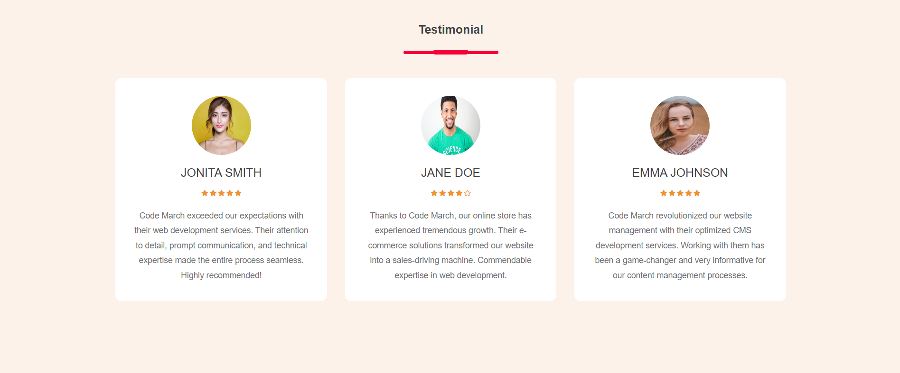
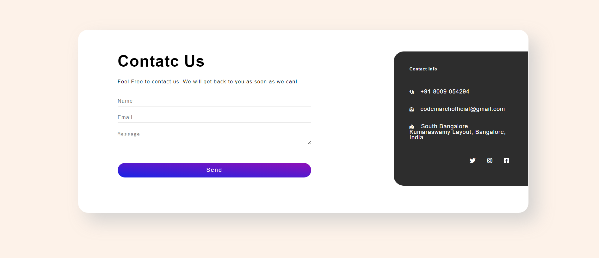
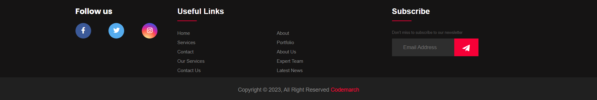
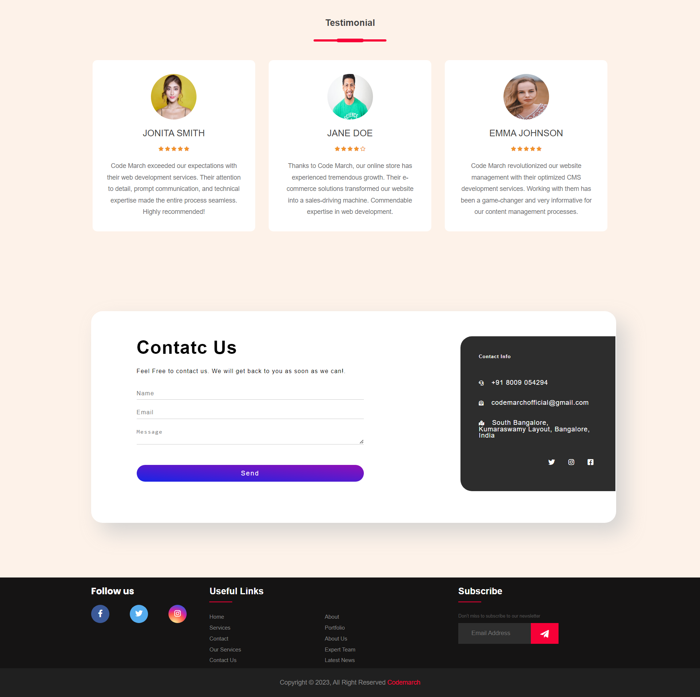
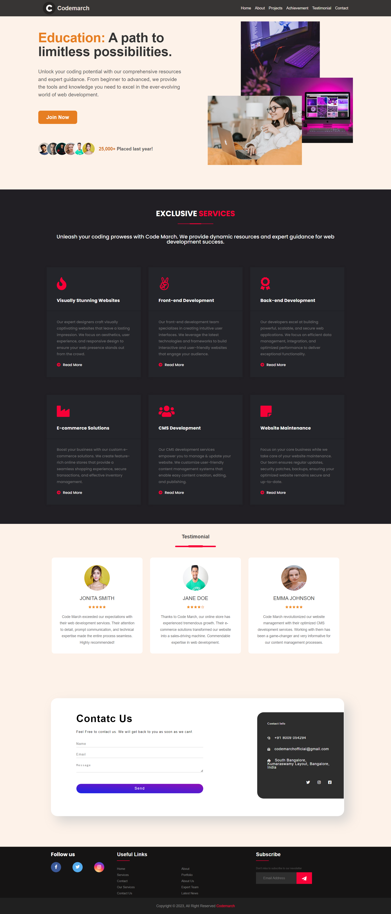

# Day - 23

**Let's pick up where we left off on the previous day (Day 22) and continue working on the projects.**

## Create Rest of Things: Testimonial, Contact US Section, and Footer Section

### Testimonials

- Create a section called Testimonials.
- Inside this section, create three cards to display testimonials.
- Each card should include the following information:
  - Person's name
  - Profile image
  - Star rating (e.g., using icons)
  - Feedback description

### Contact Us

- Create a section called Contact Us.
- On the left side of this section, include a contact form with the following fields:
  - Name
  - Email
  - Message
  - Send button
- On the right side of this section, add some cool stuff (e.g., images, icons, or additional information) to make the contact page visually appealing.

### Footer

- Create a big footer section.
- Include social media links (e.g., Facebook, Instagram, Twitter) that are clickable and navigate to the respective social media pages.
- Include a link to your projects or portfolio.
- Add a newsletter subscription form with an input field for email and a submit button.

Note:

The final output of the website has been provided as a reference.

Use your creativity and preferred styling techniques to create a visually pleasing and functional website based on the specifications.

Feel free to be creative with the layout, design, and styling of the components while ensuring they meet the requirements.

### Design of Testimonials

### Design of Contact Us

### Design of Footer

### Here is your Day 23 Assignment

### Here is the impressive representation of your entire project

## CREDITS

- **Website:**[codemarch](https://codemarch.gumroad.com/)
- **Social:** [twitter](https://twitter.com/codemarch) | [Discod](https://discord.com/invite/7g9WddcyKt)
