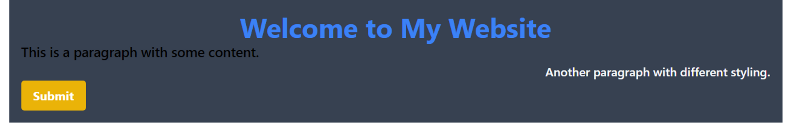

# Day - 25

- [Introduction to utility-first CSS and the benefits of using Tailwind CSS.](https://www.notion.so/Introduction-to-utility-first-CSS-and-the-benefits-of-using-Tailwind-CSS-7f909fd6db2b4897ac2e80439465877f?pvs=21)
- [Website to Practice Tailwind CSS](https://www.notion.so/Website-to-Practice-Tailwind-CSS-92abbd2248a2451eb2a13246ef3593cc?pvs=21)
- [How to set up a project with Tailwind CSS](https://www.notion.so/How-to-set-up-a-project-with-Tailwind-CSS-280db29da50e4f42b60d588435575ea7?pvs=21)
- [Font Size](https://www.notion.so/Font-Size-ed1dd75ed64345408a4e653196579b47?pvs=21)
- [Font Weight](https://www.notion.so/Font-Weight-fee36f2d59f94cbaa3f6fd0a30552467?pvs=21)
- [Text Alignment](https://www.notion.so/Text-Alignment-cfe9fd578f084e9fa61995353deb4ed7?pvs=21)
- [Text Color , Text Opacity & Hover Color](https://www.notion.so/Text-Color-Text-Opacity-Hover-Color-91eb4e6f2d4f4220a4ed142c7e7d09ba?pvs=21)
- [Background Color](https://www.notion.so/Background-Color-319cd0666f5043e38475df2f65f66199?pvs=21)

## Assignment: Styling and Layout Using Tailwind CSS

### Objective

The objective of this assignment is to familiarize yourself with the basics of Tailwind CSS and its styling capabilities. By completing this assignment, you will gain practical knowledge and hands-on experience in setting up a Tailwind CSS project, using various styling properties like font size, font weight, text alignment, text color, text opacity, hover color, and background color.

### Requirements

1. Set up the project: and access to a code editor or IDE of your choice.
2. Basic understanding of HTML and CSS.
3. Internet connectivity to download the required resources.
4. Explore Text Color, Background color, Font Weight , Font Size, Text - Alignment.

### Submission

1. A single HTML file named "index.html" contains the code for your Tailwind CSS project.
2. A CSS file named "styles.css" where will add the necessary Tailwind CSS classes and custom styles.

### Here is your Day 25 Assignment

